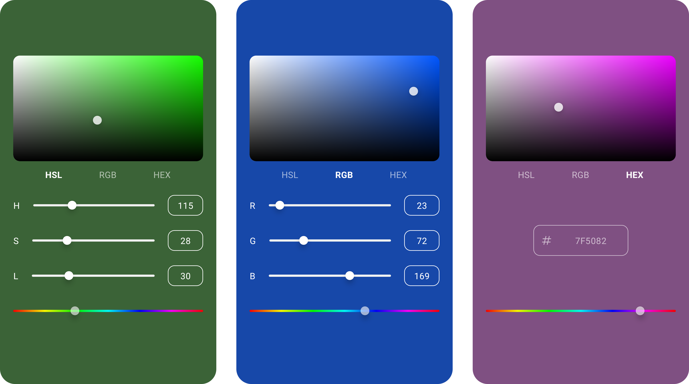

# CHROMA

A simple Jetpack Compose component for picking a color.

You can add the component to a composable simply by using `ChromaPicker` composable function as the following example below:

```kotlin
ChromaPicker(
    initialColor = Color(0xFF0047AB),
    style = ChromaPickerStyle(
        textStyles = ChromaPickerStyle.TextStyles(LocalTextStyle.current)
    )
) { newColor ->
  // use the selected color
}
```

The styling of the color picker can be changed with `ChromaPickerStyle`.
